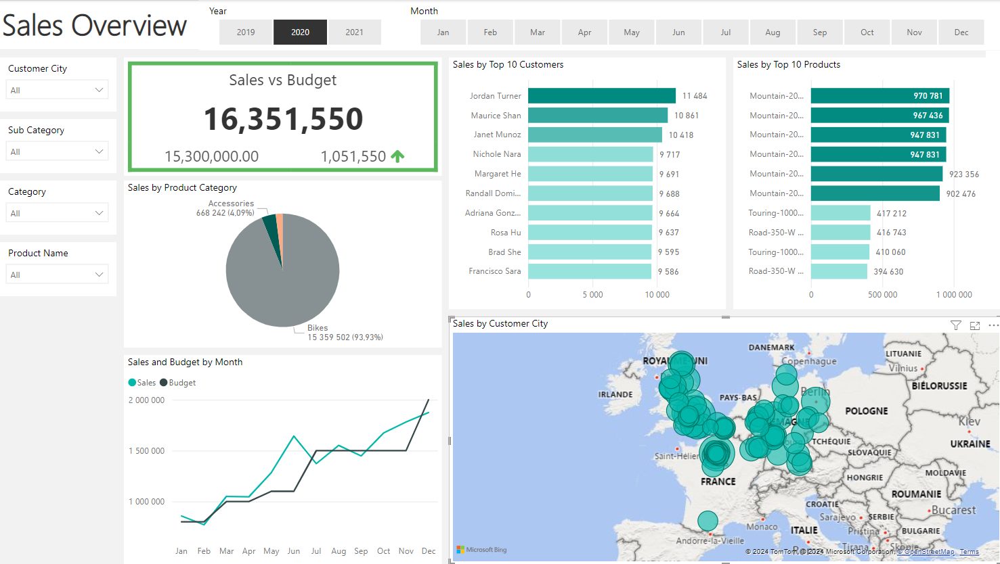

## Overview

This project focuses on transforming static sales reports into dynamic and interactive dashboards using AdventureWorks 2019 data. The goal is to provide enhanced sales insights tailored to specific business needs, enabling better decision-making and performance tracking.

The solution uses Power BI to deliver an intuitive dashboard that allows filtering and detailed analysis of sales data, integrating budget comparisons and trends over time.

## Features
**Dynamic Dashboard:**
- Visualizes Internet sales with interactive filtering options.
- Includes KPIs and charts for detailed analysis.
  
**Sales Analysis:**
- Insights into product and customer sales.
- Performance by sales representative.

**Budget Comparison:**
- Tracks actual sales vs. the 2021 budget with variance calculations.
  
**Data Refresh:**
- Automatically updates once daily to keep data current.

# Business Request Email from Steven – Sales Manager

**From**: Steven – Sales Manager   

Hi,  

I hope you are doing well.  

We need to improve our internet sales reports and want to move from static reports to visual dashboards.  

Essentially, we want to focus on:  
- How much we have sold.  
- What products have been sold.  
- To which clients.  
- Sales trends over time.  

Seeing as each salesperson works on different products and customers, it would be beneficial to have filtering options as well.  

We measure our numbers against budget, so I’ve added a spreadsheet with the budget data for 2021. This will help us compare actual sales performance against the budget. We typically look two years back in time (2020 and 2021) when analyzing sales.  

Let me know if you need anything else!  

Best regards,  
**Steven**

## User Stories

- **Reporter**: Steven – Sales Manager
- **Value of Change**: Visual dashboards and improved sales reporting or follow-up for the sales force.
- **Necessary Systems**: Power BI, CRM System
- **Other Relevant Info**: Budgets have been delivered in Excel for 2021.
  
| **No.** | **As a (Role)**         | **I want (Request / Demand)**                      | **So that I (User Value)**                                             | **Acceptance Criteria**                                             |
|---------|--------------------------|----------------------------------------------------|------------------------------------------------------------------------|----------------------------------------------------------------------|
| 1       | Sales Manager            | To get a dashboard overview of internet sales     | Can follow better which customers and products sell the best           | A Power BI dashboard which updates data once a day.                 |
| 2       | Sales Representative     | A detailed overview of Internet Sales per Customer | Can follow up my customers that buy the most and who we can sell more to | A Power BI dashboard which allows me to filter data for each customer. |
| 3       | Sales Representative     | A detailed overview of Internet Sales per Product | Can follow up my products that sell the most                           | A Power BI dashboard which allows me to filter data for each product. |
| 4       | Sales Manager            | A dashboard overview of internet sales            | Follow sales over time against budget                                  | A Power BI dashboard with graphs and KPIs comparing against budget. |

## Technical Approach

**Data Preparation:**
- Extract sales data from the AdventureWorks 2019 Data Warehouse.
- Integrate Excel-based budget data for 2021.
- Focus on historical data for the last 2 years (2020 and 2021).

**Data Cleaning and Transformation:**
- Ensure accurate mapping of sales and budget figures.
- Create calculated fields for budget variance and trends.

**Power BI Dashboard Development:**
- Design intuitive visualizations for managers and representatives.
- Implement slicers for salesperson, product, and customer filtering.
- Add KPIs for actual vs. budget analysis.

## Files in the Repository
**SQL Scripts:** For extracting and cleaning data from AdventureWorks.
**Budget Data:** Excel file with 2021 budget figures.
**Power BI File:** .pbix file containing the dashboard.
**Documentation:** Additional files with detailed explanations of the process.

## Tools and Technologies
**Database:** AdventureWorks 2019 Data Warehouse.
**Visualization:** Power BI.
**Budget File:** Excel.

## Contact 

For any questions or suggestions, feel free to open an issue on the repository or contact me at:

Email: messiliislem@gmail.com

